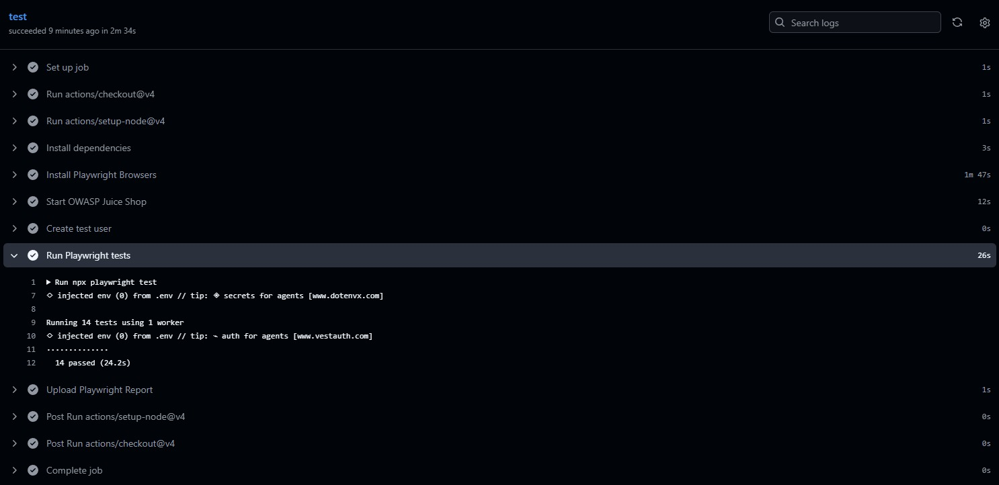

# QA Automation + Security Testing

Suite de automatización de pruebas **end-to-end, API y seguridad** construida con **Playwright** y **TypeScript**. El proyecto utiliza [OWASP Juice Shop](https://owasp.org/www-project-juice-shop/) como aplicación bajo prueba y organiza la automatización con page objects, fixtures y datos de prueba.

> **Uso responsable:** ejecutá estas pruebas únicamente contra una instancia local o un entorno para el que tengas autorización. Algunos casos de seguridad envían payloads de ataque y dos de ellos esperan explícitamente que una explotación tenga éxito; no representan una validación de que la aplicación sea segura.

## Cobertura

* **Pruebas funcionales:** inicio de sesión, búsqueda, carrito y checkout.
* **Pruebas de API:** autenticación, búsqueda de productos, reviews y consulta del usuario.
* **Pruebas de seguridad:** casos exploratorios de XSS, SQL injection y control de acceso.
* **Reportes y diagnóstico:** reporte HTML y captura de trazas en el primer reintento.
* **Integración continua:** workflow de GitHub Actions para ejecutar Playwright en push y pull request a `main` y `master`.

Los casos de SQL injection y broken access control comprueban actualmente respuestas que evidencian comportamientos vulnerables (por ejemplo, obtener un token o consultar una cesta ajena). Que esos casos pasen **no significa que el sistema sea seguro**. Revisá sus aserciones y resultados antes de usar la suite como gate de CI.

## Requisitos

* Node.js LTS y npm.
* Una instancia de OWASP Juice Shop accesible en `http://localhost:3000`.
* Una cuenta de prueba válida para los escenarios que requieren iniciar sesión.

La URL base está configurada en [`playwright.config.ts`](./playwright.config.ts). Si tu instancia usa otra URL, actualizá `baseURL` allí antes de ejecutar las pruebas.

## Instalación

```bash
npm ci

npx playwright install chromium
```

Creá un archivo `.env` en la raíz del proyecto con las credenciales de una cuenta **de prueba**:

```dotenv
TEST_USER_EMAIL=tu-usuario-de-prueba@example.com
TEST_USER_PASSWORD=tu-clave-de-prueba
```

El archivo `.env` está excluido de Git. No uses credenciales personales ni las agregues al repositorio.

## Ejecutar las pruebas

Iniciá Juice Shop en `http://localhost:3000` y, desde la raíz del proyecto, ejecutá:

```bash
# Toda la suite
npx playwright test

# Por tipo
npx playwright test tests/functional
npx playwright test tests/api
npx playwright test tests/security

# Un archivo específico
npx playwright test tests/functional/login.spec.ts

# Modo interactivo
npx playwright test --ui
```

## Reporte

Al finalizar, Playwright genera el reporte HTML en `playwright-report/`. Para abrirlo:

```bash
npx playwright show-report
```

Las trazas se recopilan en el primer reintento, según la configuración de Playwright. Los resultados de ejecución se guardan en `test-results/`; ambos directorios están excluidos de Git.

## Resultados

### Playwright Test Report

La suite cuenta actualmente con **14 pruebas automatizadas**, cubriendo pruebas funcionales, API y seguridad.


### GitHub Actions

El proyecto incluye integración continua mediante **GitHub Actions**, ejecutando automáticamente la suite de Playwright en los eventos configurados.



## Estructura

```text
.
├── .github/workflows/       # Workflow de GitHub Actions
├── docs/                    # Evidencia visual de ejecución
│   ├── playwright-report.png
│   └── github-actions.png
├── src/
│   ├── constants/           # URLs y constantes compartidas
│   ├── data/                # Datos de prueba
│   ├── fixtures/            # Fixtures de Playwright
│   ├── helpers/             # Utilidades, por ejemplo capturas
│   └── pages/               # Page objects
├── tests/
│   ├── api/                 # Pruebas de API
│   ├── functional/          # Flujos funcionales de UI
│   └── security/            # Casos de seguridad
└── playwright.config.ts     # Configuración de Playwright
```

## CI

El workflow de GitHub Actions instala las dependencias y los navegadores y ejecuta `npx playwright test`.

Para que funcione de punta a punta en GitHub Actions, el runner también necesita acceso a la aplicación bajo prueba y los secretos `TEST_USER_EMAIL` y `TEST_USER_PASSWORD`; el workflow actual no configura esos requisitos por sí solo.

## Nombre para GitHub

* **Slug recomendado:** `playwright-qa-suite`
* **Nombre visible:** *Playwright QA Suite — E2E, API & Security Testing*

Es corto, fácil de identificar en búsquedas y suficientemente amplio para reflejar los distintos tipos de pruebas del proyecto.
